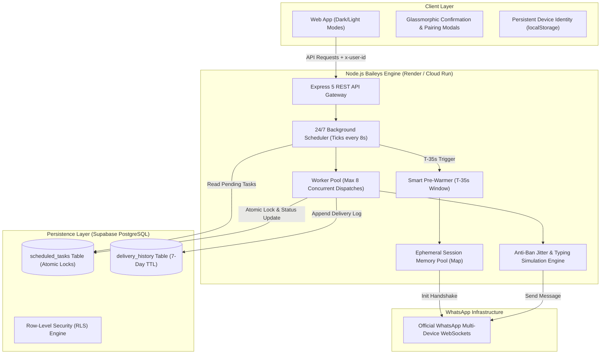

<div align="center">

# 💬 AutoMate Cloud & Desktop
### The Open-Source, Zero-Cost WhatsApp Automation Suite & 24/7 Cloud Scheduler

[](https://whatsapp-automation-and-bulk-message.onrender.com/)
[](https://nodejs.org/)
[](https://supabase.com/)
[](LICENSE)

<br/>

**AutoMate** empowers you to broadcast, automate, and schedule WhatsApp messages **24/7 in the cloud**—completely free, with zero template approval fees, zero monthly subscriptions, and zero server crashes.

[🌐 Launch Live Web App](https://whatsapp-automation-and-bulk-message.onrender.com/) • [💻 Download Desktop (.exe)](#-desktop-application) • [📖 Architecture & Docs](#-system-architecture) • [🚀 Deploy Your Own](#-one-click-cloud-deployment)

</div>

---

## 📌 Why AutoMate? (The Problem vs The Solution)

| Traditional WhatsApp APIs (Twilio / Meta) | Shady Chrome Extensions | 🚀 AutoMate Suite |
| :--- | :--- | :--- |
| ❌ Charges per message conversation ($0.05 - $0.15/msg) | ❌ High risk of WhatsApp number bans | ✅ **100% Free forever (₹0 Cost)** |
| ❌ Strict template review rejections | ❌ Requires Chrome open and laptop awake 24/7 | ✅ **24/7 Cloud Scheduler (Runs when PC is off)** |
| ❌ Heavy business registration overhead | ❌ Slow and easily crashes on bulk lists | ✅ **High-concurrency Worker Pool (8 workers)** |
| ❌ Centralized server holds private chat logs | ❌ Data privacy concerns / data harvesting | ✅ **Zero-Knowledge Privacy (Supabase RLS)** |

---

## 🌟 Core Highlights

### 🎨 1. Official WhatsApp Web Dark & Light Themes
Crafted using the exact official WhatsApp Web design system:
* **🌙 Dark Mode:** `#111b21` app background, `#202c33` chat surfaces, `#00a884` teal accent, and `#005c4b` message highlights.
* **☀️ Light Mode:** `#efeae2` chat wallpaper tone, `#ffffff` pure white cards, and `#008069` classic WhatsApp green headers.
* **Instant Toggle:** Switch themes dynamically with a single click in the top navigation bar.

### 📱 2. Two Seamless Linking Options
* **📷 QR Code Scanning:** Best for desktop users linking via their phone camera.
* **🔢 8-Digit Pairing Code (No Camera Needed):** Link directly on the **same mobile phone** without needing a secondary screen or camera! Enter your phone number, receive a code, and enter it directly in WhatsApp's *"Link with phone number instead"*.

### ⏰ 3. Precision Midnight Scheduler (12:00:00 AM)
* **Pre-Warming Socket Engine:** Connects and verifies the WhatsApp WebSocket **35 seconds ahead of time** (e.g. 11:59:25 PM) so scheduled midnight birthday messages or critical announcements fire within **2 seconds of 12:00:00 AM**!
* **Atomic Idempotent Locking:** Guarantees that no recipient ever receives duplicate messages during network reconnections.

### 👥 4. Multi-Tenant Device Isolation
* Every device (phone, laptop, tablet) automatically creates an isolated, sandboxed Device ID (`dev_xxxxxx`).
* Multiple users can use the platform simultaneously without session conflicts, cross-talk, or shared data.

### 🛡️ 5. Smart Anti-Ban Human Jitter Engine
* **Typing Presence Emulation:** Sends `sock.sendPresenceUpdate('composing')` 1.2 seconds prior to packet dispatch.
* **Randomized Intervals:** Enforces natural randomized delays (3.0s to 5.5s) between successive recipients to safeguard accounts against automated abuse filters.
* **Isolated Try-Catch:** Individual contact failures (e.g. landlines) never stop or disrupt the rest of your broadcast batch.

### 🔒 6. Zero-Knowledge Privacy & 1-Click Data Wipe
* Built on **Supabase PostgreSQL with Row-Level Security (RLS)**.
* We **never** access, monitor, or store personal chats or media.
* A dedicated **"Wipe All My Data & Disconnect"** button permanently purges all scheduled jobs, history, and unlinks your credentials in 1 second.

### 🔐 7. Google Login & Verified Cloud Security
* **Continue with Google:** Users can optionally sign in with their Google Account (powered by Supabase Auth) for enhanced trust, avatar profile display, and cross-device schedule synchronization.
* **Non-Blocking Guest Mode:** Users can still broadcast and test anonymously without mandatory login.

### ⚡ 8. 1-Click Message Templates Library
* Quick-chips toolbar in the composer for instant message drafting:
  * 🎂 **Birthday Wishes:** Polite, emoji-rich celebration messages.
  * 🪔 **Festival Greetings:** Warm wishes for Diwali, Eid, New Year, Christmas, etc.
  * 💳 **Payment Due Reminders:** Courteous invoice reminder format with `{Amount}` & `{Date}` placeholders.
  * 📢 **Important Announcements:** Formal notices with date variables.
  * 💼 **Meeting Reminders:** Punctual scheduling confirmations.

### ⭐ 9. Beta Tester Feedback & Review System
* Early beta testers can submit interactive 5-star ratings, category tags, and reviews directly from the web app.
* Dual persistence (Supabase PostgreSQL `user_feedback` table + resilient local storage fallback) ensures zero review loss.


---

## 🏗️ System Architecture



---

## 💻 Desktop Application

For users who prefer a **100% offline, zero-server-dependency solution**:
* **Standalone Windows Executable:** Download [`AutoMate_Pro.zip`](AutoMate_Pro.zip) from the repository root.
* **Extract & Run:** Double-click `AutoMate_App.exe` to launch the native Python/Tkinter GUI automation tool that interfaces directly with the official Windows WhatsApp Desktop application.

---

## 🚀 One-Click Cloud Deployment

### Deploy on Render (Free Tier)

[](https://render.com/)

1. Fork or clone this repository to your GitHub account.
2. Create a new **Web Service** on [Render Dashboard](https://dashboard.render.com/).
3. Connect your repository and configure:
   * **Runtime:** `Node`
   * **Build Command:** `cd web_app && npm install`
   * **Start Command:** `node web_app/server.js`
4. Set Environment Variables:
   ```env
   PORT=10000
   SUPABASE_URL=https://your-project.supabase.co
   SUPABASE_KEY=your-supabase-secret-key
   ```
5. **Automated 24/7 Uptime (Zero Configuration):**
   * AutoMate includes an internal keep-alive agent that automatically pings `/api/health` every 10 minutes to reset Render's 15-minute idle timer.
   * Supabase database queries run on a 6-hour heartbeat schedule to prevent Supabase's 7-day project inactivity pause.

---

## 🛡️ 24/7 Zero-Inactivity Engine (Render & Supabase Protection)

Cloud free tiers enforce aggressive inactivity policies that normally break automated schedulers. AutoMate completely solves both limitations through a dual-layer architecture:

| Problem | Cause | AutoMate Solution |
| :--- | :--- | :--- |
| **Render 15-Min Sleep** | Render Free Tier spins down web services after 15 minutes of inactivity, pausing midnight cron jobs. | **Layer 1:** Built-in Node.js Keep-Alive Agent pings `${RENDER_EXTERNAL_URL}/api/health` every 10 minutes.<br/>**Layer 2:** GitHub Actions workflow (`.github/workflows/keep_alive.yml`) sends external pings every 10 minutes for 100% cloud redundancy. |
| **Supabase 7-Day Pause** | Supabase pauses free-tier PostgreSQL projects after 7 consecutive days of zero database queries. | **Layer 1:** Built-in Supabase Heartbeat in `db.js` probes the database every 6 hours (4 times daily), resetting the 7-day timer.<br/>**Layer 2:** Dedicated `/api/keepalive/supabase` endpoint allows automated external monitoring. |

### Diagnostic & Keep-Alive Endpoints

* **`GET /api/health`**: Returns comprehensive uptime, Render keep-alive status, Supabase heartbeat latency, active sessions, and memory stats.
* **`GET /api/keepalive/supabase`**: Triggers an instant database heartbeat probe to Supabase and returns latency.
* **`GET /api/keepalive/render`**: Dispatches an immediate keep-alive ping to the public Render URL.

---

## 💻 Local Development Setup

### Prerequisites
* [Node.js](https://nodejs.org/) v18.0.0 or higher
* [Git](https://git-scm.com/)

### 1. Clone & Install
```bash
git clone https://github.com/Aadarsh2021/Whatsapp-Automation-and-bulk-message-sender.git
cd Whatsapp-Automation-and-bulk-message-sender
npm install
cd web_app && npm install
```

### 2. Configure Environment (`web_app/.env`)
Create a `.env` file inside `web_app/`:
```env
PORT=3000
SUPABASE_URL=https://pnjoqcmqlmpnvvehkixr.supabase.co
SUPABASE_KEY=sb_secret_your_secret_key_here
```
*(Note: If no Supabase key is provided, the server automatically boots in Local Resilient Fallback mode with zero crashes).*

### 3. Launch the Server
```bash
npm start
```
Visit **`http://localhost:3000`** in your browser.

---

## 🗄️ Supabase Schema Setup

1. Open the **SQL Editor** in your [Supabase Project Dashboard](https://supabase.com/dashboard).
2. Copy and execute the contents of [`web_app/supabase_schema.sql`](web_app/supabase_schema.sql).
3. This creates:
   * `scheduled_tasks` with atomic locks (`locked_at`, `worker_id`).
   * `delivery_history` with indexed timestamps.
   * Auto-pruning functions for completed records.
   * Row-Level Security (RLS) policies.

---

## 📡 API Reference

| Endpoint | Method | Description |
| :--- | :---: | :--- |
| `/api/health` | `GET` | Health check, active worker count, and memory metrics |
| `/api/status` | `GET` | Scoped connection status, QR code, and user profile |
| `/api/request-pairing-code` | `POST` | Generate 8-digit same-phone verification code |
| `/api/send-now` | `POST` | Immediate background broadcast to recipient list |
| `/api/schedule` | `POST` | Create 24/7 cloud scheduled broadcast job |
| `/api/scheduled` | `GET` | Retrieve device's pending and completed jobs |
| `/api/scheduled/:id` | `DELETE`| Cancel a pending scheduled broadcast |
| `/api/history` | `GET` | Retrieve delivery logs and recipient statuses |
| `/api/logout` | `POST` | Disconnect WhatsApp session and clean local keys |
| `/api/wipe-data` | `POST` | 1-Click GDPR purge of all device tasks, logs, and sessions |

---

## 🛡️ Security, Privacy & Compliance

* **Airtight `.gitignore`:** Environment keys (`.env`, `*.env`), private WhatsApp credentials (`session_data/`, `auth_info_baileys/`), and runtime logs are strictly ignored from source control.
* **Instant Revocation:** You retain complete control to revoke this connection at any moment directly from your smartphone via **WhatsApp > Settings > Linked Devices > Log out**.
* **Responsible Messaging:** This software is designed for personal scheduling, birthday wishes, team updates, and opt-in reminders. Always adhere to WhatsApp's Terms of Service and refrain from sending unsolicited spam.

---

## 📄 License

This project is licensed under the **MIT License** — see the [LICENSE](LICENSE) file for full details.

---

<div align="center">

Made with ❤️ by [Aadarsh Thakur](https://github.com/Aadarsh2021) and Contributors

⭐ **Star this repository if you found it useful!**

</div>
