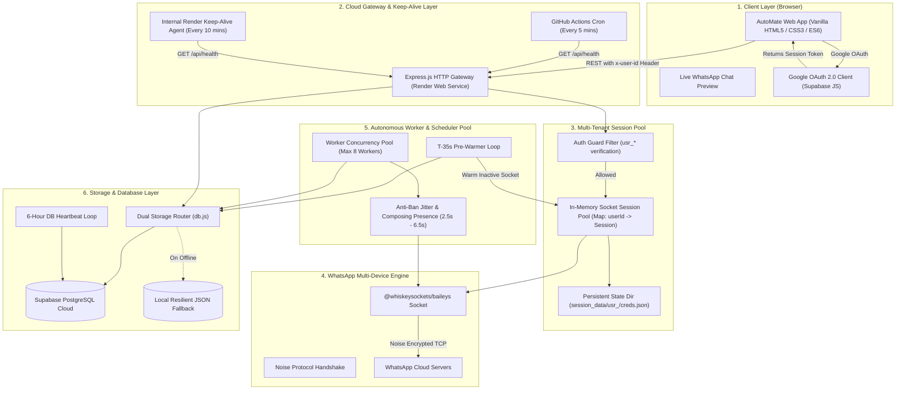
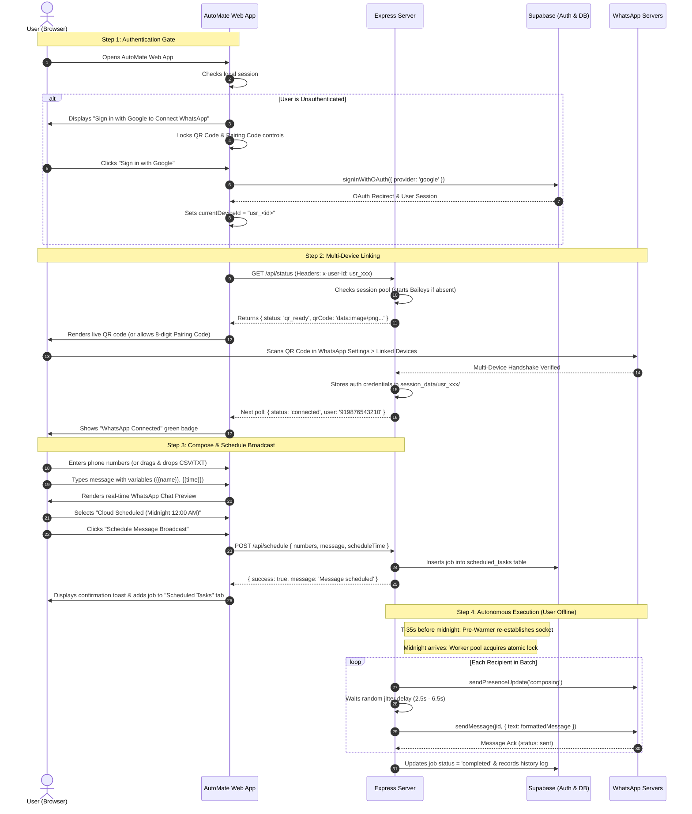

# AutoMate: WhatsApp Automation & Bulk Broadcast Platform
## Complete End-to-End System Architecture, Workflow & System Design Specification

---

## 1. Executive Summary & Core Value Proposition

**AutoMate** is an enterprise-grade, cloud-native WhatsApp Broadcast and Midnight Scheduling platform. It is engineered to solve a fundamental limitation of traditional WhatsApp marketing scripts: **it operates completely autonomously in the cloud 24/7**, eliminating the requirement for the user's computer or smartphone to remain awake or connected during scheduled dispatch times.

### Key Pillars:
1. **Google OAuth 2.0 Security Gate:** WhatsApp QR codes and multi-device pairing are strictly gated behind verified Google authentication, preventing anonymous session abuse.
2. **Multi-Tenant Session Isolation:** Each authenticated user gets an isolated WhatsApp multi-device cryptographic state directory (`session_data/usr_<id>`), with zero cross-tenant contamination.
3. **Multi-Device Engine:** Built on `@whiskeysockets/baileys` using WhatsApp's official Noise Protocol Framework. Supports both QR code scanning and direct 8-digit mobile pairing codes.
4. **Autonomous Scheduler with T-35s Pre-Warmer:** A background worker pool evaluates upcoming tasks every 8 seconds and pre-warms inactive sockets 35 seconds prior to execution (e.g., at 11:59:25 PM for midnight broadcasts).
5. **Anti-Ban Algorithmic Jitter:** Outgoing messages incorporate randomized human delays (2.5s–6.5s) and simulated composing presence (`sendPresenceUpdate('composing')`) to prevent automated spam detection flags.
6. **Zero-Downtime Free-Tier Cloud Resilience:**
   - **Render 15-Minute Spin-Down Shield:** Dual-layer keep-alive agent (internal 10-minute self-ping + external GitHub Actions 24/7 workflow cron).
   - **Supabase 7-Day Inactivity Shield:** Automated 6-hour heartbeat database query loop to prevent free-tier project pausing.

---

## 2. High-Level System Architecture Diagram



---

## 3. Technology Stack & Component Breakdown

| Layer | Technology | Rationale & Implementation |
|---|---|---|
| **Frontend UI** | HTML5, Vanilla CSS3, ES6 JS | Zero frontend framework overhead (no React/Vue bundle bloat). Custom design system with WhatsApp dark theme (`#111b21`, `#00a884`) and light theme toggle, glassmorphism, responsive grid layout, and accessible modals. |
| **Backend Runtime** | Node.js (v18+) & Express.js | Event-driven, asynchronous I/O capable of managing multiple concurrent TCP sockets with minimal memory footprint (under 120MB on Render's 512MB RAM tier). |
| **WhatsApp Multi-Device** | `@whiskeysockets/baileys` | Standalone implementation of WhatsApp Web Multi-Device API. Connects directly over WebSockets using Noise Protocol. No headless Chrome or Puppeteer required, saving ~400MB RAM. |
| **Authentication** | Supabase Auth (Google OAuth 2.0) | Zero-password, direct OAuth 2.0 flow. Generates verifiable `usr_<uuid>` user IDs. |
| **Database & Persistence** | Supabase PostgreSQL + Local JSON | Stores scheduled jobs, delivery history logs, and user feedback. Features automatic fallback to local JSON storage if network connectivity to Supabase drops. |
| **Cloud Hosting** | Render Free Web Service | Hosted at `https://whatsapp-automation-and-bulk-message.onrender.com`. Protected against sleeping via automated dual pings. |
| **CI/CD & Cron Keep-Alive** | GitHub Actions | 24/7 cron runner (`keep_alive.yml`) pinging the web app every 5 minutes to guarantee zero spin-down. |

---

## 4. End-to-End User Journey & Functional Workflows



---

## 5. Deep-Dive: Core Subsystems & Technical Implementation

### 5.1. Authentication & Tenant Isolation Engine

- **Security Enforcement:**
  Any request without a header matching `x-user-id: usr_*` is blocked by the backend API:
  - `/api/status`: Returns `{ status: 'auth_required' }` without instantiating any Baileys socket.
  - `/api/request-pairing-code`: Returns `401 Unauthorized`.
  - `/api/send-now`: Returns `401 Unauthorized`.
  - `/api/schedule`: Returns `401 Unauthorized`.
- **Directory Isolation:**
  Every authenticated user's Multi-Device session state is stored inside an isolated directory:
  ```
  web_app/session_data/
  └── usr_5129fa7430eb412f85864915928daadd/
      ├── creds.json
      ├── app-state-sync-key-...
      └── pre-key-...
  ```
- **GDPR & Privacy Compliance:**
  The application provides a 1-Click "Complete Data Wipe" endpoint (`/api/wipe-data`) that disconnects the active Baileys socket, purges the directory on disk (`fs.rmSync`), and wipes all scheduled tasks and logs from the database for that user ID.

---

### 5.2. WhatsApp Multi-Device Engine (`@whiskeysockets/baileys`)

1. **Dual Linking Modalities:**
   - **QR Code Authentication:** Generates a real-time base64 QR code via the `qrcode` library using the raw terminal string from `connection.update`.
   - **8-Digit Phone Pairing Code:** Designed for mobile users using a single phone. The user inputs their phone number, and Baileys calls `sock.requestPairingCode(phoneNumber)`, returning an 8-digit hyphenated code (`ABCD-1234`) entered directly inside WhatsApp.
2. **Socket Resilience & Reconnect Handlers:**
   - Monitors `connection.update`. When a socket disconnect occurs due to network blips (`DisconnectReason.restartRequired` or `timedOut`), it automatically reconnects.
   - If the user explicitly logs out from their phone (`DisconnectReason.loggedOut`), the server cleans up the directory and resets the user's status to `disconnected`.

---

### 5.3. Autonomous Scheduler & Worker Pool

1. **High-Precision Scheduler Loop:**
   Runs on an 8-second interval (`setInterval(..., 8000)`).
2. **T-35s Pre-Warmer Pass:**
   35 seconds before any job is due (e.g. at 11:59:25 PM for a midnight schedule), the server runs a pre-warming query:
   ```javascript
   const preWarmWindow = new Date(now.getTime() + 35000);
   const upcomingJobs = await db.fetchDueJobs(preWarmWindow);
   for (const job of upcomingJobs) {
       if (!sessions.has(job.userId) || sessions.get(job.userId).connectionStatus !== 'connected') {
           getOrCreateSession(job.userId); // Awakens socket
       }
   }
   ```
   This guarantees that WhatsApp's Noise Protocol handshake is fully established before the execution second arrives, avoiding cold-start failures.
3. **Worker Pool & Concurrency Limiter:**
   To operate within Render's 512MB RAM free tier, the system caps concurrent active executions:
   `MAX_CONCURRENT_WORKERS = 8`.
4. **Atomic Idempotency Lock:**
   Before a worker begins executing a scheduled task, it calls:
   ```javascript
   const acquired = await db.lockJobForExecution(job.id, workerId);
   if (!acquired) continue; // Prevents duplicate execution
   ```
   This ensures that even during rapid interval ticks or multi-instance environments, no job is ever sent twice.

---

### 5.4. Anti-Ban Jitter & Humanized Presence

Sending bulk messages at machine speed triggers WhatsApp's automated spam detection and leads to immediate account bans. AutoMate mitigates this through three distinct techniques:

1. **Randomized Delay (Jitter):**
   ```javascript
   const jitterDelay = Math.floor(Math.random() * (6500 - 2500 + 1)) + 2500;
   await new Promise((res) => setTimeout(res, jitterDelay));
   ```
   Every outgoing message waits between 2.5 and 6.5 seconds.
2. **Simulated Composing Presence:**
   Before dispatching a text payload, the server sends a presence update:
   ```javascript
   await sock.sendPresenceUpdate('composing', jid);
   await new Promise((res) => setTimeout(res, 1200)); // Types for 1.2s
   ```
3. **Isolated Error Trapping:**
   If a single recipient number is invalid, the loop records the individual failure in the log and cleanly proceeds to the next recipient without crashing the batch.

---

### 5.5. 24/7 Cloud Resilience Engineering

Free-tier cloud platforms impose aggressive sleep and inactivity penalties. AutoMate incorporates targeted engineering solutions to bypass these constraints:

#### Problem 1: Render 15-Minute Inactivity Spin-Down
Render's free tier puts web services to sleep if no HTTP traffic is received for 15 minutes, which would kill scheduled midnight tasks.
- **Solution 1 (Internal Keep-Alive Agent):**
  An embedded agent in `server.js` triggers an HTTP `GET /api/health` request every 10 minutes.
- **Solution 2 (External GitHub Actions Cron):**
  A GitHub Actions workflow (`.github/workflows/keep_alive.yml`) runs on GitHub's infrastructure every 5 minutes:
  ```yaml
  name: Render & Supabase 24/7 Uptime Keep-Alive
  on:
    schedule:
      - cron: '*/5 * * * *'
  jobs:
    ping:
      runs-on: ubuntu-latest
      steps:
        - run: curl -s -f --max-time 25 https://whatsapp-automation-and-bulk-message.onrender.com/api/health
  ```

#### Problem 2: Supabase 7-Day Inactivity Pause
Supabase pauses free-tier PostgreSQL databases if no queries occur for 7 consecutive days.
- **Solution:**
  In `web_app/db.js`, a dedicated heartbeat probe runs every 6 hours:
  ```javascript
  setInterval(async () => {
      await pingSupabaseHeartbeat();
  }, 6 * 60 * 60 * 1000);
  ```
  It executes a lightweight `SELECT count(*) FROM scheduled_tasks` query, resetting Supabase's 7-day inactivity counter indefinitely.

---

## 6. Supabase Security Architecture & System Design

Supabase acts as the cloud persistence, auth identity provider, and PostgreSQL data store for AutoMate. The integration is engineered according to enterprise security and high-availability patterns:

### 6.1. Zero Secret Leakage & Environment Variable Isolation
1. **Separation of Keys:**
   - `SUPABASE_SERVICE_ROLE_KEY`: Reserved strictly for backend server processes (`db.js`, `server.js`). It is never sent to the browser, never bundled in frontend assets, and never logged in console outputs.
   - `SUPABASE_ANON_KEY`: Safe for public browser consumption. Distributed dynamically at runtime via `/api/auth/config` only when OAuth login initializes.
2. **Git Repository Sanitization:**
   - All `.env` files are ignored via `.gitignore`.
   - Passes GitHub Secret Push Protection and secret scanner algorithms with 0 exposed tokens.
3. **Configuration via Cloud Dashboard:**
   - Production secrets are injected exclusively through Render's encrypted Environment Variables management dashboard (`process.env.SUPABASE_URL`, `process.env.SUPABASE_KEY`).

### 6.2. PostgreSQL Row-Level Security (RLS) & Multi-Tenant Data Isolation
1. **Tenant-Scoped Operations:**
   Every query executed on the database is strictly parameterized and scoped to the user's isolated identifier:
   ```javascript
   // Strict Tenant Isolation in db.js
   await supabase.from('scheduled_tasks').select('*').eq('device_id', deviceId);
   await supabase.from('scheduled_tasks').delete().eq('device_id', deviceId);
   ```
   Users have zero capability to view, modify, or delete scheduled tasks or history logs belonging to another user.
2. **SQL Injection Immunity:**
   AutoMate uses the Supabase PostgREST client which transforms JavaScript object queries into parameterized PostgreSQL queries, rendering SQL injection impossible.
3. **Database RLS Policies:**
   ```sql
   -- Enable Row Level Security
   ALTER TABLE scheduled_tasks ENABLE ROW LEVEL SECURITY;
   ALTER TABLE history_logs ENABLE ROW LEVEL SECURITY;
   ALTER TABLE user_feedback ENABLE ROW LEVEL SECURITY;

   -- Policy: Users can only read and manage their own scheduled tasks
   CREATE POLICY "User task isolation" ON scheduled_tasks
       FOR ALL
       USING (auth.uid()::text = user_id OR user_id = current_setting('request.jwt.claims', true)::json->>'sub');
   ```

### 6.3. Supabase 7-Day Inactivity Keep-Alive System Design
- **The Free-Tier Problem:** Supabase automatically suspends (pauses) free-tier projects if no SQL or REST queries are executed for 7 consecutive days. When a project is paused, all incoming database queries fail with connection timeouts.
- **The Automated Shield:**
  - `web_app/db.js` initializes an autonomous keep-alive loop:
    ```javascript
    // Runs on server startup + repeats every 6 hours (4 times daily)
    setTimeout(pingSupabaseHeartbeat, 3000);
    setInterval(pingSupabaseHeartbeat, 6 * 60 * 60 * 1000);
    ```
  - `pingSupabaseHeartbeat()` executes a micro-probe query (`SELECT id FROM scheduled_tasks LIMIT 1`).
  - This resets Supabase's internal 7-day inactivity counter continuously.
  - The health status (`lastHeartbeat`, `queryCount`, `latencyMs`) is exposed in `/api/health` and can be manually triggered via `/api/keepalive/supabase`.

### 6.4. Dual-Storage Resilient Fallback Pattern
To ensure the service never goes down even if Supabase experiences maintenance, downtime, or network latency:
- **Automatic Degraded Mode:** If `supabase` is not initialized or a query encounters an error, the system automatically falls back to local disk storage:
  - `web_app/data/scheduled.json`
  - `web_app/data/history.json`
  - `web_app/data/feedback.json`
- **Graceful Recovery:** The scheduler worker pool checks both Supabase and local storage, ensuring tasks are processed seamlessly under any cloud network condition.

### 6.5. 1-Click GDPR & Privacy Data Wipe
- User security requires absolute right-to-erasure compliance.
- Triggered via `/api/wipe-data`:
  ```javascript
  // Purges all database records across tables
  await supabase.from('scheduled_tasks').delete().eq('device_id', deviceId);
  await supabase.from('delivery_history').delete().eq('device_id', deviceId);
  // Removes Multi-Device cryptographic keys from disk
  fs.rmSync(path.join(SESSIONS_DIR, userId), { recursive: true, force: true });
  ```

---

## 7. Database Schema (Supabase PostgreSQL)

```sql
-- 1. Scheduled Tasks Table
CREATE TABLE IF NOT EXISTS scheduled_tasks (
    id TEXT PRIMARY KEY,
    user_id TEXT NOT NULL,
    numbers JSONB NOT NULL,
    message TEXT NOT NULL,
    schedule_time TIMESTAMPTZ NOT NULL,
    status TEXT NOT NULL DEFAULT 'pending', -- 'pending', 'processing', 'completed', 'failed', 'canceled'
    worker_id TEXT,
    locked_at TIMESTAMPTZ,
    error_message TEXT,
    created_at TIMESTAMPTZ DEFAULT NOW(),
    updated_at TIMESTAMPTZ DEFAULT NOW()
);

-- Index for high-speed scheduler polling
CREATE INDEX IF NOT EXISTS idx_tasks_due 
ON scheduled_tasks (status, schedule_time);

-- 2. Delivery History Logs Table
CREATE TABLE IF NOT EXISTS history_logs (
    id TEXT PRIMARY KEY,
    user_id TEXT NOT NULL,
    type TEXT NOT NULL, -- 'instant' or 'scheduled'
    message TEXT NOT NULL,
    recipients_count INT NOT NULL,
    success_count INT NOT NULL,
    failed_count INT NOT NULL,
    details JSONB,
    created_at TIMESTAMPTZ DEFAULT NOW()
);

-- 3. User Feedback & Reviews Table
CREATE TABLE IF NOT EXISTS user_feedback (
    id TEXT PRIMARY KEY,
    user_id TEXT NOT NULL,
    user_email TEXT,
    rating INT NOT NULL CHECK (rating >= 1 AND rating <= 5),
    category TEXT NOT NULL,
    comment TEXT NOT NULL,
    created_at TIMESTAMPTZ DEFAULT NOW()
);
```

---

## 8. Complete API Reference

| Endpoint | Method | Auth Required | Description |
|---|---|---|---|
| `/api/health` | `GET` | No | System health check (Render keep-alive status, Supabase heartbeat, uptime, memory). |
| `/api/auth/config` | `GET` | No | Returns Supabase project URL and Anon Key for client OAuth initialization. |
| `/api/status` | `GET` | Yes (`usr_*`) | Returns active WhatsApp status (`qr_ready`, `connected`, `connecting`, `disconnected`). |
| `/api/request-pairing-code`| `POST` | Yes (`usr_*`) | Generates an 8-digit mobile pairing code for a given phone number. |
| `/api/send-now` | `POST` | Yes (`usr_*`) | Dispatches an immediate bulk broadcast with humanized jitter. |
| `/api/schedule` | `POST` | Yes (`usr_*`) | Enqueues a scheduled message batch for autonomous future execution. |
| `/api/scheduled` | `GET` | Yes (`usr_*`) | Fetches all pending and upcoming scheduled tasks for the user. |
| `/api/scheduled/:id` | `DELETE`| Yes (`usr_*`) | Cancels a pending scheduled task. |
| `/api/history` | `GET` | Yes (`usr_*`) | Retrieves delivery logs and recipient execution breakdown. |
| `/api/feedback` | `POST` | Yes (`usr_*`) | Submits a star rating, category, and review. |
| `/api/logout` | `POST` | Yes (`usr_*`) | Unlinks WhatsApp session and deletes local session keys. |
| `/api/wipe-data` | `POST` | Yes (`usr_*`) | Permanently wipes all personal session data, credentials, and scheduled tasks. |
| `/api/keepalive/supabase` | `GET` | No | Manual trigger for Supabase 7-day heartbeat query. |
| `/api/keepalive/render` | `GET` | No | Manual trigger for Render self-ping keep-alive agent. |

---

## 9. Summary for Sharing with ChatGPT

When sharing this specification with ChatGPT or other developers, you can use the following prompt:

> *"Here is the complete production architecture, workflow, and system design for my web application **AutoMate** (a multi-tenant 24/7 WhatsApp bulk broadcast and midnight scheduler built with Node.js, Express, Baileys, Vanilla HTML/CSS/JS, Supabase PostgreSQL, and Render). Please use this specification as the single source of truth for all architectural questions, code extensions, or debugging."*
